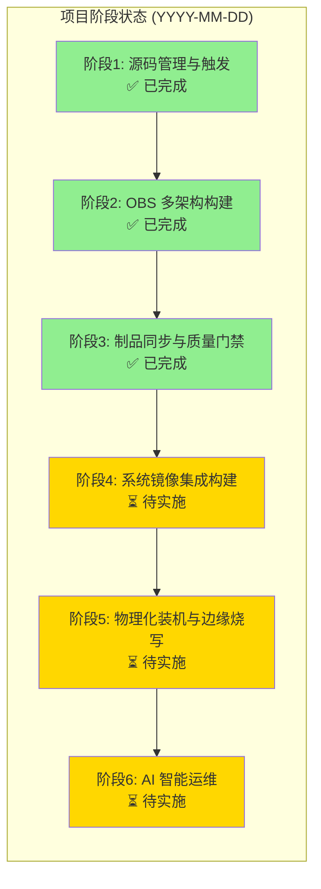

# Architecture Diagram Tracking Pattern

## Purpose

Track architecture diagram completeness as project progresses through implementation stages.

## Pattern

1. **Create ARCHITECTURE_DIAGRAMS.md** in project root with Mermaid diagrams
2. **Include a "阶段完成状态" (Stage Completion Status) diagram** that shows progress
3. **Update the status diagram** after each stage verification

## Status Diagram Template



## Progress Report Template

When user asks for progress report:

```markdown
【项目名称 工作进度报告】

📅 报告日期：YYYY年MM月DD日

一、项目概述
二、阶段完成情况 (✅/🔲)
三、今日验证成果 (Pipeline details)
四、关键技术决策
五、运行服务清单
六、下一步计划
七、风险与问题
```

## Architecture Completion Report Template

When user asks about architecture diagram completeness:

```markdown
# 架构流程图完成度报告

一、架构图集概览 (表格列出所有图)
二、阶段完成状态图 (Mermaid)
三、各阶段详细完成度
四、架构图与实际状态对照
五、总体完成度 (进度条)
六、建议
```

## Key Metrics

- **架构图数量**: Total diagrams created
- **完成组件数**: Implemented vs planned components
- **验证流程**: Pipeline ID and status

## File Locations

- Architecture diagrams: `ARCHITECTURE_DIAGRAMS.md` (project root)
- Progress reports: `docs/reports/progress-report-YYYYMMDD.md`
- Architecture completion: `docs/reports/architecture-diagram-completeness-YYYYMMDD.md`
- Technical completion: `docs/reports/technical-architecture-completion-YYYYMMDD.md`